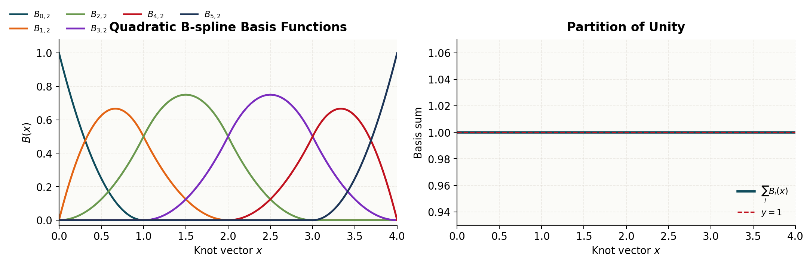
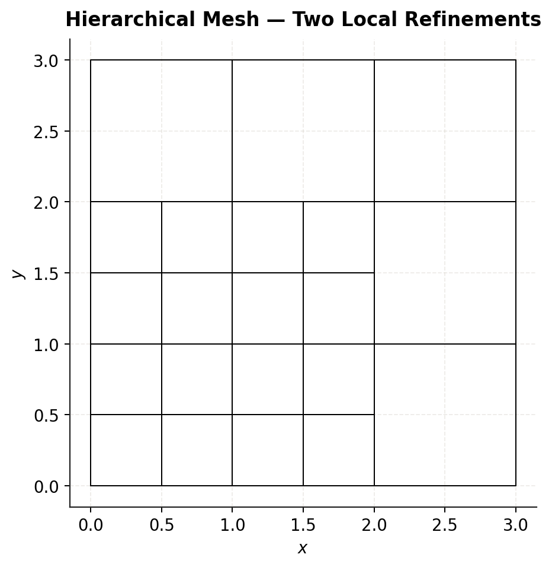
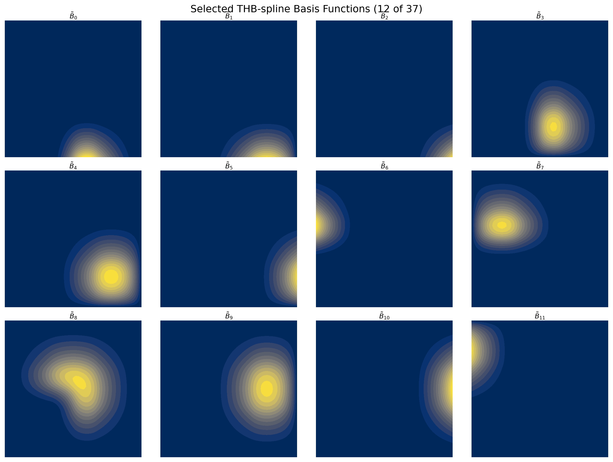
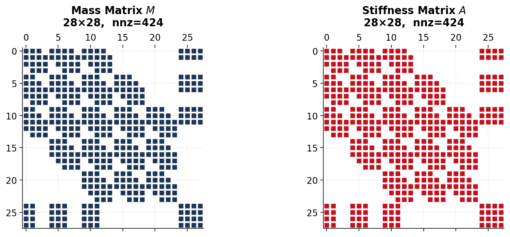
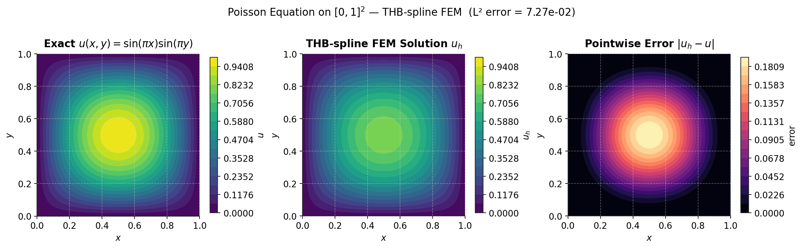

# Splinery

A pure **NumPy/SciPy** Python workbench for studying, implementing, and comparing
spline technologies developed in the **Isogeometric Analysis (IGA)** era (post-2005).

The goal is to build each method from first principles — readable, self-contained code
that matches the mathematics in the original papers — with consistent FEM demos so the
methods can be compared fairly.

> This project is for **learning and research purposes**.
> Correctness and clarity are prioritized over performance.

---

## Roadmap

### Implemented

| Method | Status | Notes |
|---|---|---|
| **THB-Splines** (Truncated Hierarchical B-Splines) | ✅ complete | Partition of unity, adaptive refinement, Poisson FEM |
| **LR-Splines** (Locally Refined B-Splines) | ✅ complete | Overloading algorithm, T-junctions, Poisson FEM |

### Planned

#### Local Refinement / Adaptive Methods

| Method | Description |
|---|---|
| **HB-Splines** | Non-truncated hierarchical B-splines; predecessor to THB-Splines |
| **PHT-Splines** | Polynomial splines over hierarchical T-meshes; fast conversion from NURBS |
| **RHT-Splines** | Rational extension of PHT-Splines for 3D elasto-statics/dynamics |
| **TDHB-Splines** | Truncated decoupled hierarchical B-splines; decoupled basis variant |

#### Unstructured / Arbitrary Topology

| Method | Description |
|---|---|
| **AS-T-Splines** | Analysis-suitable T-splines with extraordinary points; arbitrary-topology shells |
| **G-Splines** | G¹-continuous generalization across extraordinary points on quad layouts |
| **U-Splines** | Unstructured splines with smooth high-order bases on arbitrary topology |
| **D-Patch** | G¹ continuity via collapsed extraction coefficients; IGA shells |

#### Subdivision-Based

| Method | Description |
|---|---|
| **Catmull-Clark** | Arbitrary-topology subdivision surfaces; gap-free control grids |
| **Loop Subdivision** | Triangle-based scheme; IGA for surface PDEs on triangular meshes |

#### Triangulation-Based

| Method | Description |
|---|---|
| **Powell-Sabin Splines** | Piecewise quadratic C¹ on triangulations; IGA for advection-diffusion |
| **TCB-Splines** | Triangle-configuration B-splines over general polygonal domains |
| **rTBS** | Rational triangular Bézier splines; watertight trimmed NURBS representations |

#### Boundary / Trimming-Oriented

| Method | Description |
|---|---|
| **B++ Splines** | Analytic trimmed NURBS; Kronecker-delta property for strong Dirichlet BCs |
| **WEB-Splines** | Weighted extended B-splines for complex-boundary domains |

---

## Implemented Methods

### THB-Splines

Truncated Hierarchical B-splines organize B-spline basis functions into levels of resolution.
Coarser-level functions are **truncated** wherever finer-level functions are active, which
guarantees partition of unity, linear independence, and sparsity.

Reference: [Giannelli et al. (2012)](https://doi.org/10.1016/j.cma.2012.04.027),
implementation following [Bracco et al. (2017)](https://doi.org/10.1016/j.apnum.2017.08.006).

### LR-Splines

Locally Refined B-splines achieve local refinement by inserting **partial knot line segments**
(T-junctions) rather than full lines. Each insertion splits only the basis functions it
overloads via one-step Boehm knot insertion.

Key correctness guarantees in this implementation:
- **LLI check**: after every partial insertion, `check_lli` is called and a `warnings.warn`
  is raised if Local Linear Independence is violated.
- **Full-line guard**: calling `refine_full_line` after partial insertions raises `RuntimeError`
  to prevent silent destruction of T-junction structure.

Reference: [Dokken, Lyche & Pettersen (2013)](https://doi.org/10.1016/j.cma.2013.09.018).

---

## Benchmark Problem

Both implemented methods are validated on the same model problem:

$$-\Delta u = f \quad \text{on } [0,1]^2, \qquad u\big|_{\partial\Omega} = 0$$

with manufactured solution $u(x,y) = \sin(\pi x)\sin(\pi y)$ and
$f(x,y) = 2\pi^2 \sin(\pi x)\sin(\pi y)$.

Common implementation choices (both methods):
- Dirichlet BCs via **Greville abscissae** (support bounding boxes incorrectly mark all
  clamped B-splines as boundary DOFs)
- Load vector by **element-wise Gauss quadrature** over active cells (Riemann sums have
  ~6% relative error for this problem)

---

## Notebooks

| Notebook | Description |
|---|---|
| `THBSplines_tutorial.ipynb` | THB basis construction, adaptive refinement, matrix assembly, Poisson FEM |
| `LRSplines_tutorial.ipynb` | LR basis construction, T-junction refinement, matrix assembly, Poisson FEM |
| `Poisson_comparison.ipynb` | Side-by-side comparison of THB and LR on the benchmark problem; convergence study |

---

## Requirements

- Python >= 3.10
- NumPy, SciPy, Matplotlib, tqdm

**Quick setup:**

```bash
chmod +x setup_venv.sh && ./setup_venv.sh
source .venv-thbsplines/bin/activate
```

**Run the tests:**

```bash
pytest THBSplines/tests/ -v
pytest LRSplines/tests/ -v
```

**Open a tutorial:**

```bash
jupyter lab notebooks/THBSplines_tutorial.ipynb
jupyter lab notebooks/LRSplines_tutorial.ipynb
jupyter lab notebooks/Poisson_comparison.ipynb
```

---

## Gallery

### B-spline basis functions

Six quadratic basis functions on `[0, 4]` with a clamped knot vector, and their sum (partition of unity).



---

### Adaptive hierarchical mesh (THB)

Two rounds of local dyadic refinement applied to the lower-left region of a biquadratic mesh.



---

### THB-spline basis functions

Selected truncated hierarchical basis functions after two adaptive refinements.
Each function has compact support smaller than or equal to the corresponding HB-spline support.



---

### Mass and stiffness matrix sparsity

Sparsity patterns of the assembled mass matrix **M** and stiffness matrix **A**
on an adaptively refined biquadratic space.



---

### Poisson solution — THB-splines

Exact solution, FEM approximation, and pointwise error on an adaptively refined mesh.



---

## Quick-start Code

### THB-Splines

```python
import numpy as np
import THBSplines as thb

knots = [
    [0, 0, 0, 0.25, 0.5, 0.75, 1, 1, 1],
    [0, 0, 0, 0.25, 0.5, 0.75, 1, 1, 1],
]
T = thb.HierarchicalSpace(knots, [2, 2], dim=2)

rect = np.array([[0.25, 0.75], [0.25, 0.75]])
T = thb.refine(T, {0: T.refine_in_rectangle(rect, level=0)})

T.mesh.plot_cells()

M = thb.hierarchical_mass_matrix(T)
A = thb.hierarchical_stiffness_matrix(T)
print(f"DOFs: {T.nfuncs}  |  A shape: {A.shape}  |  A nnz: {A.nnz}")
```

### LR-Splines

```python
import numpy as np
from LRSplines import LRSplineSpace
from LRSplines.src.refinement import refine_region

sp = LRSplineSpace(
    [0, 0, 0, 0.25, 0.5, 0.75, 1, 1, 1],
    [0, 0, 0, 0.25, 0.5, 0.75, 1, 1, 1],
    degree_u=2, degree_v=2,
)

refine_region(sp, 0.25, 0.75, 0.25, 0.75, n_lines_u=2, n_lines_v=2)

sp.mesh.plot()

from LRSplines.src.assembly import lr_stiffness_matrix, lr_load_vector
A = lr_stiffness_matrix(sp)
f = lr_load_vector(
    sp,
    lambda pts: 2*np.pi**2 * np.sin(np.pi*pts[:,0]) * np.sin(np.pi*pts[:,1]),
)
print(f"DOFs: {sp.nfuncs}  |  A shape: {A.shape}  |  A nnz: {A.nnz}")
```
